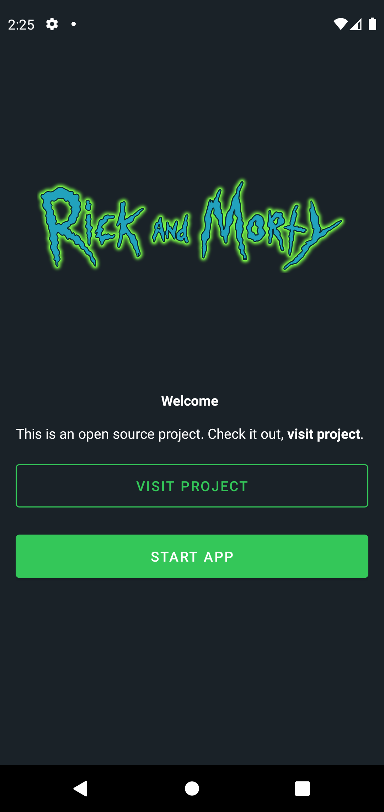
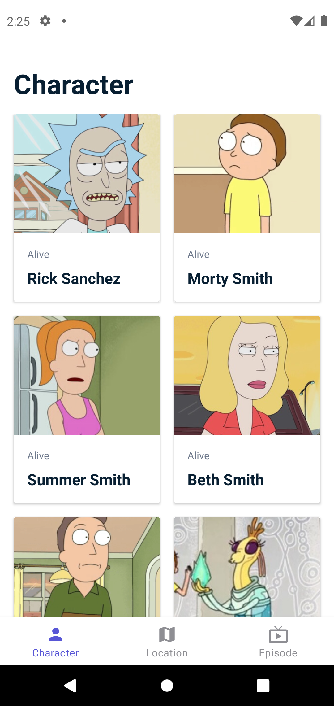

# rick-and-morty-app

All the data is on [Rick and Morty API](https://rickandmortyapi.com/). Use this application in your case studies purposes. 

## Tech

- Kotlin: programming language
- MVVM: Model-View-ViewModel
- Multimodule Application
- StateFlow
- Dagger: Dependency injection
- Android Extensions (KTX)
- Architecture Components
- Constraintlayout
- RecyclerView
- Coroutines
- Picasso
- Facebook ShimmerLayout
- Kotlinx Serialization
- Retrofit2 (including adapters and converters)
- Chucker
- Room
- JUnit
- Mockk
- Lottie
- [Navigation by Deeplinks and Dagger](https://medium.com/@burkedamian/navigation-in-modular-applications-with-deep-linking-6a599c11e487) 

## Showcase

    

    

    

    

## LICENSE
MIT © [MIT](../LICENSE)
